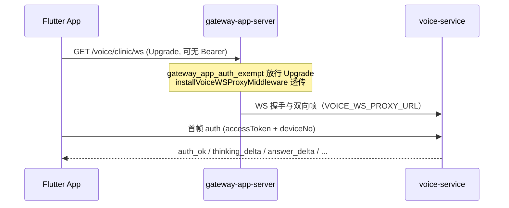

## Context

- **现状**：首页喂养 AI（voice ball `/voice/chat/ws`）以 **deviceNo** 为连接主键（`VoiceWSManager` 同设备互踢）；`wxId` 来自 Upgrade 头 `X-Internal-Wx-Id`（网关带 Bearer 时注入）或 `deviceNo` 反查，**非**连接绑定维度。月度额度 `voice_ai` 默认 5 次；LLM 超时在 `voice-chat.shared.yaml` 约 20s；ASR WS 已独立且 **不** 注册 `VoiceWSManager`。
- **目标**：竞品差异化「胖宝 AI 诊室」——结合近 7 天喂养 **聚合摘要** 的 DeepSeek 流式 Q&A（含 thinking），独立 WS、**wxId 主键**会话/限流/额度、超时配置。
- **约束**：voice 禁止跨库直查 history/device 表；须经 `DeviceHistory()` HTTP 契约；Redis 新键须 proposal 记录「负责人已确认」；禁止新增测试文件与背景 ticker；Flutter 跨仓 `d:\work\flutter_ai_talk`。

## Goals / Non-Goals

**Goals:**

- 提供 **gateway-app-server** 对外 `GET /voice/clinic/ws`（App 同域 WS 入口）；voice-service 承载 clinic 业务 handler；上行 `auth`（首帧）+ `question`，下行 `thinking_delta` / `answer_delta` / `answer_done` / `error`。
- **wxId 主键绑定**：鉴权、会话 Redis、限流、额度均围绕 `wx.id`；`deviceNo` 仅用于 history 摘要数据源（须与 JWT `device_no` claim 一致）。
- 每问前懒刷新 7 天 event 级聚合摘要（count/amount/duration），注入 system prompt，节省 token。
- 12h Redis 会话（首问起算、非 sliding，键 `voice:clinic:session:{wxId}`）；独立 per-wxId rate limit；`clinic_ai` 额度默认 30/月。
- **gateway-app-server** 注册 `/voice/clinic/ws` WS 透传 + Bearer 豁免；隐私政策与独立 consent；Flutter 经 `apiBaseUrl` 连接胖宝页与 thinking UI。

**Non-Goals:**

- TTS、语音输入（MVP 纯文本）、与 voice ball 共用连接管理。
- 在 voice-service 内新增 ticker 扫表或后台 reconciler。
- 原始 7 天 history 全量 dump 进 prompt。

## Decisions

### 1. 命名与边界

- 用户可见：**胖宝**；代码/配置/Redis：`clinic` / `clinic_ai` / `aiClinic`。
- 实现宿主：**voice-service**（WS handler + LLM）；**gateway-app-server**（App 对外 WS 入口：透传 + Bearer 豁免）；额度权威 **device-service**；history 读 **history HTTP 契约**（沿用 `DeviceHistory().ListHistory` 或等价 internal API，voice 内聚合）。

### 1.1 App 流量路径（gateway-app 注册）

胖宝为 **App gateway** 能力，对外 URL **MUST** 经 **gateway-app-server** 暴露（与 `/voice/chat/ws`、`/voice/asr/ws`、`/device/app/ws/history`、`/ucg/app/ws/chat` 同 `apiBaseUrl` 主机），**MUST NOT** 要求 Flutter 直连 voice-service 内网地址。



| 层级 | 职责 | 代码落点 |
|------|------|----------|
| **gateway-app-server** | App 对外入口；Bearer 豁免；可选 Upgrade 时注入 `X-Internal-Wx-Id`（若客户端带 Bearer） | `gateway_app_register.go` → `installVoiceWSProxyMiddleware`；`gateway_app_auth_exempt.go`；`ws_route_proxy.go` `voiceWSProxyPaths` |
| **gateway-service** | 同路径透传（管理/通用网关，非 App 主入口） | `register.go` → `installVoiceWSProxyMiddleware` |
| **voice-service** | clinic WS handler、摘要、LLM、session/限流/额度 | `BindHandler("/voice/clinic/ws", ...)` |
| **Flutter** | `wsClinicUrl` = `wss://{apiBaseUrl}/voice/clinic/ws` | `env.dart` `wsClinicUrlEffective` |

### 2. WebSocket 协议与身份绑定

**App 对外路径**：`GET /voice/clinic/ws`（gateway-app-server，经 `voiceWSProxyPaths` 透传至 voice-service 同路径）。

**voice-service 内部路径**：`GET /voice/clinic/ws`（`BindHandler` 注册 clinic handler）。

#### 2.1 与 `/voice/chat/ws` 对比（MUST 实现差异）

| 维度 | `/voice/chat/ws`（voice ball） | `/voice/clinic/ws`（胖宝） |
|------|-------------------------------|---------------------------|
| **连接主键** | `deviceNo`（`start` 帧） | **`wxId`**（首帧 `auth` JWT `sub`） |
| **VoiceWSManager** | 注册；同 `deviceNo` 新连接踢旧连接 | **不**注册 |
| **网关 HTTP Bearer** | 豁免；wxId 可选（Upgrade 头或反查） | 豁免；**首帧 `auth` 必填** `accessToken` |
| **wxId 要求** | 可选；缺失时可 `deviceNo` 反查用于额度 | **必须** `wxId>0`；**禁止**仅凭 `deviceNo` 反查替代登录 |
| **deviceNo 角色** | 会话/ASR/LLM 主键 | 仅 history 摘要拉取；须与 JWT `device_no` 一致 |
| **会话 Redis** | 无（流式音频会话在内存） | `voice:clinic:session:{wxId}` |
| **限流维度** | 无独立 clinic 限流 | `voice:clinic:rate:{wxId}` |
| **额度 feature** | `voice_ai` | `clinic_ai`（per wxId） |
| **TTS** | 有 | 无 |

#### 2.2 握手与鉴权

gateway-app-server 对 `/voice/clinic/ws` **豁免 HTTP Bearer**（列入 `gatewayAppAuthExemptExactGET`，同 `/voice/asr/ws`），因 WebSocket Upgrade 常不带 `Authorization`；身份在 voice-service **首帧** `auth` 校验。

若 Upgrade 请求**可选**携带 Bearer，`installGatewayAppBearerMiddleware`（`HookBeforeServe`）MAY 在豁免路径上仍调用 `InjectAccessHeadersFromBearer` 注入 `X-Internal-Wx-Id`；clinic handler **MUST NOT** 依赖该头作为唯一鉴权来源（与 ASR/history/UCG 首帧 JWT 模式一致）。

**握手后首帧（客户端 → 服务端）**：JSON `type=auth`，对齐 `/device/app/ws/history` 与 `/ucg/app/ws/chat` 模式：

```json
{ "type": "auth", "accessToken": "<JWT>", "deviceNo": "<与 JWT device_no claim 一致>" }
```

voice-service MUST：

1. `ParseAccessClaims(accessToken)` 得 `wxId` 与 `deviceNoFromJWT`。
2. 拒绝 `wxId≤0`（40301）。
3. 拒绝 `deviceNo` 缺失或与 JWT `device_no` 不一致（参数错误帧）。
4. 下发 `auth_ok` 后方可接收 `question`。

**MUST NOT** 依赖 Upgrade 阶段 `X-Internal-Wx-Id` 作为唯一鉴权来源（网关豁免时该头可能缺失）；若客户端经直连 voice-service 且头已注入，实现 MAY 与首帧 JWT 交叉校验，但以首帧 JWT 为准。

**上行 `question` 帧**（`auth_ok` 之后）：

```json
{ "type": "question", "text": "宝宝最近奶量正常吗？" }
```

**下行帧**：

| type | 说明 |
|------|------|
| `thinking_delta` | DeepSeek reasoning 增量 `{ "type":"thinking_delta", "delta":"..." }` |
| `answer_delta` | 正文增量 |
| `answer_done` | 流结束 `{ "type":"answer_done", "thinking":"...", "answer":"..." }`（可选全量） |
| `error` | `{ "type":"error", "code":40301\|40302\|42901\|..., "message":"..." }` |
| `auth_ok` | 首帧鉴权成功 `{ "type":"auth_ok", "code":0 }` |

**MUST NOT** 注册 `VoiceWSManager`（与 ASR WS 同策略）。

### 3. 7 天聚合摘要（buildClinicHistorySummary）

- 窗口：滚动 7×24h，按 `Asia/Shanghai` 本地日界或 Unix cutoff（与现有 voice history 窗口一致用 Unix cutoff）。
- 数据源：`DeviceHistory().ListHistory(deviceNo)`，voice 进程内聚合，**禁止**直连 history MySQL。
- 聚合维度：按 `eventId`/`eventName` 分组，输出每 event：
  - `count`：记录条数
  - `total_amount`：可累加数值型 `eventNumber` 之和（带 unit）
  - `total_duration_minutes`：起止时间差之和（sleep 等 duration 型 event）
  - 可选 `last_at`：最近一条时间
- 格式：紧凑 JSON 或结构化文本块注入 system prompt，**非**原始行列表。

### 4. 懒刷新摘要（方案 B）

Redis 键：`voice:clinic:summary:{wxId}:{deviceNo}`，字段含 `summary`（序列化文本/JSON）、`historyWatermark`（history 域最后更新时间或 max(updated_at)）、`computedAt`。

每收到 `question`：

1. 读 history 侧 watermark（HTTP 契约，如 list 响应 meta 或 dedicated head API；若无则 fallback 全量 list 的 max 时间戳）。
2. 若 Redis 摘要不存或 `historyWatermark` 落后于当前 watermark → 重算摘要并写 Redis（TTL 与会话解耦，建议 24h 或与会话同 12h）。
3. 将摘要 + 会话内 prior Q&A（存 session）拼入 messages，调用 LLM。

### 5. 会话 TTL（固定，非 sliding）

- 键：**`voice:clinic:session:{wxId}`**（wxId 主键，**不含** deviceNo）
- **选型理由**：`clinic_ai` 额度、限流、用户身份均以 `wx.id` 为权威维度；与 voice ball 以 `deviceNo` 注册 `VoiceWSManager` 形成显式对比。同一 wx 账号在 12h 内仅维护一条胖宝多轮上下文；`deviceNo` 在 `auth` 时锁定用于 history 摘要（单账号通常仅一个活跃绑定设备）。若未来需多设备并行诊室，可增量改为 `{wxId}:{deviceNo}`，本变更 MVP 以 wx 为会话桶。
- **首问**时创建，`firstQuestionAt` + **12h** 固定 TTL（Redis `SET EX`，**不在**后续提问中 `EXPIRE` 续期）。
- Session 存：会话内 Q&A 轮次（供多轮上下文）、`firstQuestionAt`、**auth 时锁定的 `deviceNo`**（摘要与校验用）。
- 进入胖宝页 **不** 创建 session；`auth_ok` 后不创建；仅首条 `question` 触发 session 写入。

### 6. LLM 配置

- 模型：`deepseek-v4-pro`（voice-service `aiClinic.model`）。
- Thinking：`extra_body.thinking` 或等价字段 + `reasoning_effort: high`。
- 超时：**120s**，配置在 `manifest/config/config.voice-service.yaml` 的 `aiClinic.llmTimeoutSeconds`，**不**写入 `voice-chat.shared.yaml`。
- 流式解析：区分 reasoning channel 与 content channel，映射到 `thinking_delta` / `answer_delta`。

### 7. 额度 clinic_ai

- device DB/API：新增 `clinicAiMonthlyLimit` 全局默认 **30**；per-wxId override 第三字段；Redis `ai:usage:clinic_ai:{wxId}:{YYYYMM}`。
- internal API `feature` 枚举扩展 `clinic_ai`。
- voice clinic handler：LLM 前 `check`，成功后 `consume`；40301 未登录、40302 额度用尽（与 voice_ai 语义一致）。
- Admin UI（device admin 或 ucg-admin 代理）：第三输入框「胖宝 AI 月度次数」。

### 8. Rate limit

- 键：**`voice:clinic:rate:{wxId}`**（per wxId，与额度维度一致；**非** per deviceNo）
- 策略：滑动窗口或固定窗口（如 10 req/min），超限返回 WS `error` code **42901**。
- **负责人已确认** Redis 读缓存/限流键（见 proposal）。

### 9. Gateway-app 注册（App 对外入口，MUST）

与 `/voice/asr/ws` 对齐，**gateway-app-server** MUST 完成以下三项（缺一不可）：

1. **WS 透传**：`internal/controller/ws_route_proxy.go` 将 `/voice/clinic/ws` 加入 `voiceWSProxyPaths`；`RegisterGatewayAppHTTP` 已调用 `installVoiceWSProxyMiddleware(s)`，复用 `VOICE_WS_ROUTE_MODE` / `VOICE_WS_PROXY_URL` 将握手与双向帧转发至 voice-service。
2. **Bearer 豁免**：`gateway_app_auth_exempt.go` 的 `gatewayAppAuthExemptExactGET` 增加 `/voice/clinic/ws`。
3. **禁止 App 直连 voice-service**：Flutter `wsClinicUrl` / `wsClinicUrlEffective` MUST 基于 `apiBaseUrl`（gateway-app 主机）推导，不得指向 voice-service 内网 URL。

**gateway-service**（`register.go`）SHOULD 同步 `voiceWSProxyPaths` 以保持一致，但 **App 客户端主入口为 gateway-app-server**。

**不在 gateway-app 本地实现 clinic 业务**：与 voice chat/ASR 相同，gateway 仅透传，clinic 逻辑仅在 voice-service。

### 10. 合规与 Consent

- `privacy-policy.html`：修正 DashScope/DeepSeek 供应商描述；新增胖宝使用近 7 天喂养摘要、展示 AI 思考过程说明。
- Flutter 独立 consent 键 `pangbao_ai_consent_v1`（与首页喂养 AI consent 分离）；每条 AI 回复 UI 展示「本回答仅供参考，不能替代医生诊断」。

### 11. Flutter（flutter_ai_talk）

- `home_immersive_header.dart`：**保留** 原 **趋势** 入口（`Icons.insights` → `/trends`），**新增** **胖宝** 入口（`Icons.pets` → `/pangbao`）与之并列，不得移除趋势图表能力。
- 新 `pangbao_ai_screen.dart`、`clinic_ws_client.dart`；`env wsClinicUrl` + `wsClinicUrlEffective` 默认由 `apiBaseUrl` 推导 `wss://{host}/voice/clinic/ws`（对齐 `wsVoiceAsrUrlEffective`，**不得**直连 voice-service）。
- **ClinicWsClient 鉴权**：连接后 **首帧** 发送 `type=auth`（`accessToken` + `deviceNo`，与 history WS / UCG chat 一致）；**不得**假设仅靠 `deviceNo` 即可提问。未登录（无有效 JWT / 40301）须引导登录。
- WS 生命周期：对齐 UCG chat——App 进后台 disconnect，回前台可重连（重连须重新 `auth`）；session 由服务端 Redis `voice:clinic:session:{wxId}` 维持。
- **Thinking UI**：默认最多可见 5 行，不足则弹性高度；流式时自动滚到最新；超过 5 行折叠，点击展开或局部滚动；用户手动上滑 pin 后停止 auto-scroll。
- `ai_quota_models` 增加 `clinicAi`；额度用尽弹框复用 40302 文案。

## Risks / Trade-offs

- **[Risk] 7 天 list 全量拉取性能** → 懒刷新 + 仅 watermark 变化时重算；history 契约若数据量大可后续加 internal 聚合 API（本变更 MVP 进程内聚合）。
- **[Risk] 120s 长连接占用** → clinic 独立 WS，不与 voice ball 争用；gateway 透传超时配置对齐 voice WS。
- **[Risk] thinking 流过长** → Flutter 折叠 UI + 服务端不持久化 thinking 全文到 DB（仅当次 WS）。
- **[Risk] 摘要失真** → 聚合规则在 spec 中固定 count/amount/duration 语义；prompt 声明「摘要非完整记录」。

## Migration Plan

1. device-service 迁移：ai_quota 表/配置增 `clinic_ai` 列，默认 30；部署 device-service。
2. voice-service：配置 `aiClinic:`、实现 clinic handler；部署 voice-service。
3. **gateway-app-server**：`voiceWSProxyPaths` + auth exempt；部署 gateway-app-server（App 主入口）。
4. **gateway-service**（可选同步）：`voiceWSProxyPaths` 同步。
5. 隐私政策 HTML 随 gateway 静态资源发布。
6. Flutter 发版：consent + 胖宝页 + `wsClinicUrl` 指向 gateway-app。
7. **Rollback**：自 `voiceWSProxyPaths` 与 auth exempt 移除 `/voice/clinic/ws` 即可停用 App 入口；voice handler 可保留；旧 App 无胖宝入口不受影响。

## Open Questions

（无——产品决策已在 exploration 阶段全部确认。）
