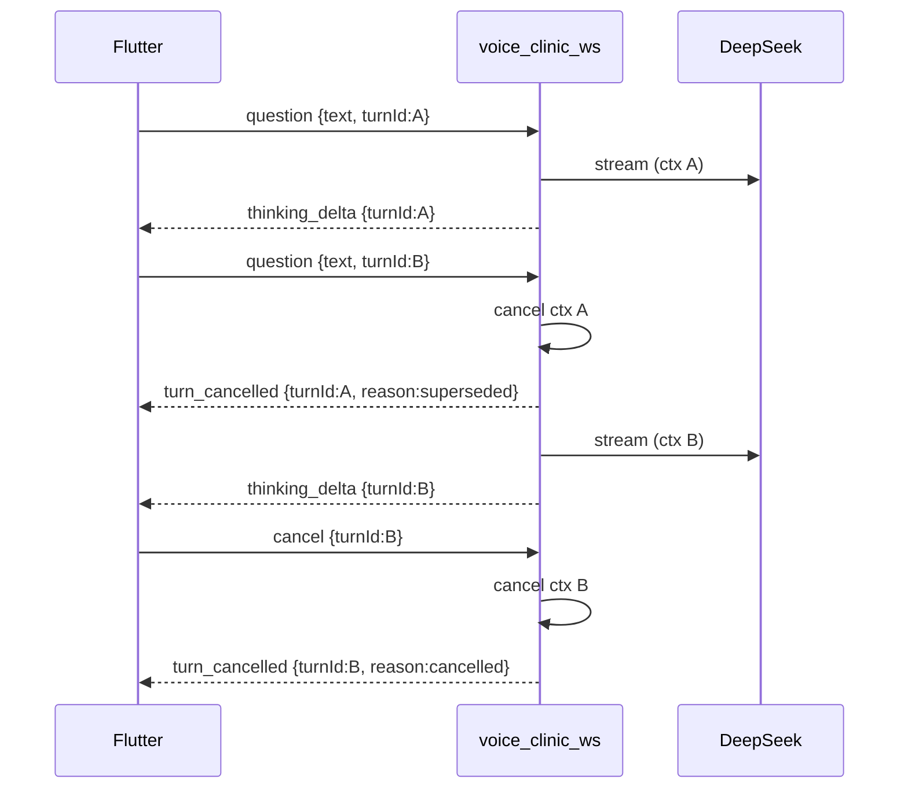

## Context

- **现状**：`voice_clinic_ws.go` 读循环在 `case "question"` 中**同步**调用 `HandleQuestion`，阻塞后续帧（含 `cancel`）直至 LLM 流结束。`HandleQuestion` 在 `question` 入口即 `INCR` 限流并 check 额度，流式成功后 `ConsumeClinicAIQuota` + `appendClinicTurn`；无 `turnId`，下行 delta 无法与客户端 active turn 对齐。
- **Flutter**：`pangbao_ai_screen.dart` 在 `_busy` 时禁用输入；`dispose` / App 后台仅 `disconnect` WS，不发送显式 cancel；无 stale 帧过滤。
- **约束**：不新增 Redis 键、不新增 background ticker、不新增测试文件；voice 禁止跨库；跨仓 `flutter_ai_talk`；建立在 `add-pangbao-ai-clinic-room`、`amend-pangbao-clinic-ux`（`session_sync`、thinking 内层滚动）之上。

## Goals / Non-Goals

**Goals:**

- 用户在 **thinking 与 answer 流式阶段** 可停止、改问（supersede）或离开页面时**显式 cancel**，服务端及时中断 DeepSeek 流。
- 引入 **`turnId`** 关联上下行帧；下发 **`turn_cancelled`** 明确结束原因。
- **cancelled / superseded** 轮次不 consume `clinic_ai`；限流仅在 **`answer_done` 成功** 后计数；session 仅 append 完成轮次。
- Flutter 流式期间输入可用；按 `turnId` 过滤 stale delta；页面退出/后台 **先 cancel 再断 WS**。

**Non-Goals:**

- 修改 `/voice/clinic/ws` 路径、session 12h TTL、Redis schema、网关透传。
- 恢复被取消轮次的 partial thinking/answer 到 session 或 UI 历史。
- 新增 TTS、新 HTTP 接口、usage 统计变更。
- 服务端持久化 in-flight turn 状态（仅连接级内存 `activeTurn`）。

## Decisions

### 1. turnId 与帧协议

**约定**：客户端每发一次 `question` 生成 UUID v4 作为 `turnId`；服务端原样回显于所有该 turn 的下行帧。

| 方向 | type | 字段 |
|------|------|------|
| 上行 | `question` | `text`（非空）, `turnId`（非空 UUID） |
| 上行 | `cancel` | `turnId`（非空；MAY 省略 text） |
| 下行 | `thinking_delta` / `answer_delta` / `answer_done` | 现有字段 + **`turnId`** |
| 下行 | `turn_cancelled` | **`turnId`**, **`reason`**: `superseded` \| `cancelled` \| `disconnected` |

- **`superseded`**：同一连接收到**新** `question`（不同 `turnId`）时，对上一 active turn 取消并下发。
- **`cancelled`**：收到匹配 `turnId` 的 `cancel` 帧。
- **`disconnected`**：WS 关闭或读循环退出时对 active turn 取消（客户端可能已离线，仍 cancel LLM ctx）。

**向后兼容**：旧 App 不发 `turnId` 时，服务端 MAY 拒绝 `question`（code 400「缺少 turnId」）——本变更 **BREAKING** 于 WS 协议层，需 Flutter 同步发版；不在 MVP 保留无 turnId 路径。

### 2. 服务端连接状态与并发模型

每个 WS 连接维护（`voice_clinic_ws.go` 或 clinic handler struct）：

```go
type clinicConnState struct {
    activeTurnID string
    cancelTurn   context.CancelFunc // 取消当前 LLM 子 ctx
    turnMu       sync.Mutex
}
```

**读循环**：

1. 解析帧 → `question` / `cancel` / unknown。
2. `question`：校验 `turnId`+`text` → 若已有 active turn，**先** `cancelTurn()` + 写 `turn_cancelled{reason:superseded}` → 创建 `turnCtx, cancel := context.WithCancel(connCtx)` → 更新 `activeTurn` → **goroutine** 调用 `HandleQuestion(turnCtx, ..., turnId, ...)`。
3. `cancel`：若 `turnId` 匹配 active，调用 `cancelTurn()` + 写 `turn_cancelled{cancelled}`；不匹配 **MAY** 静默忽略（已结束）。
4. 读循环 **MUST NOT** 阻塞在 `HandleQuestion` 上。

**WS 关闭**：`defer` 中若 `activeTurn` 非空，调用 `cancelTurn()`（不下发 `turn_cancelled`，连接已断；日志 reason=disconnected）。

**HandleQuestion 内**：

- 使用传入 `turnCtx` 贯穿摘要、LLM HTTP 流；ctx cancelled 时停止读流、**MUST NOT** `ConsumeClinicAIQuota`、**MUST NOT** `appendClinicTurn`、**MUST NOT** 写 `answer_done`。
- 所有 `writeJSON` 帧带 `turnId`。
- 正常完成：写 `answer_done` → consume → append session → **recordClinicRateLimit**（见决策 3）。



### 3. 额度与限流语义

| 事件 | clinic_ai consume | 限流 INCR |
|------|-------------------|-----------|
| `answer_done` 成功 | **YES** | **YES** |
| `turn_cancelled` (cancel/supersede) | **NO** | **NO** |
| WS disconnect 中断 | **NO** | **NO** |
| LLM/摘要 error 帧 | **NO** | **NO** |

**实现**：

- 将 `checkClinicRateLimit` 的 `INCR` 从 `question` 入口移至 **`answer_done` 成功后**（函数重命名如 `recordClinicRateLimitOnSuccess`）；`question` 入口仅 **check** 当前计数是否已达上限（读 GET/不 INCR，或 INCR 后 DECR on cancel——**采用「仅 success INCR」** 更简单）。
- `CheckClinicAIQuota` 仍在 **goroutine 启动前**（或 LLM 调用前）执行，避免无额度仍开流；cancel 不 consume。
- supersede 连续改问：每次新 `question` 仍 check 额度，但**未完成的旧 turn 不扣费**；产品默认 supersede **不额外扣费**。

### 4. Session 写入

- 仅 `answer_done` 路径调用 `appendClinicTurn`（现有逻辑，加 turn ctx 守卫）。
- cancelled / superseded / disconnected 的 partial **MUST NOT** 写入 `voice:clinic:session:{wxId}`。
- LLM 上下文（prior turns）仍仅含已完成 Q&A（与现网一致）。

### 5. Flutter 行为

**ClinicWsClient**：

- 生成/持有 `_activeTurnId`；`sendQuestion(text)` 分配新 UUID，发送 `{type:question, text, turnId}`。
- `sendCancel(turnId)` → `{type:cancel, turnId}`。
- 解析 `turn_cancelled`、带 `turnId` 的 delta；不匹配 `_activeTurnId` 的 delta **MUST** 丢弃。

**PangbaoAiScreen**：

- **移除**流式期间全局 `_busy` 输入锁；保留发送按钮或 stop：发送新问 = 新 turnId（自动 supersede）；stop = `sendCancel(activeTurnId)`。
- **`dispose` / `AppLifecycleState.paused`**：若存在 active turn，**先** `sendCancel`（best-effort，短 timeout），再 `disconnect` WS（替换「仅 disconnect」）。
- 收到 `turn_cancelled`：清除进行中 assistant/thinking UI；`superseded` 时若已有新 turn 则无额外 UI；`cancelled` 可 toast「已停止」。
- **可选**：tap 用户气泡进入编辑，预填 text，发送新 question（新 turnId）supersede。

**与 session_sync**：历史仍仅 completed turns；进行中被 cancel 的半条不进入 `_items` 持久展示（与后端一致）。

## Risks / Trade-offs

- **[Risk] cancel 帧在 disconnect 前未送达** → 服务端 WS close 仍 cancel LLM ctx（`disconnected`）；客户端不依赖必达 ack。
- **[Risk] supersede 与限流** → 仅 success INCR，频繁改问不刷限流计数；极端 spam 仍受窗口内 success 上限约束。
- **[Risk] 旧 App 无 turnId** → 明确 breaking，需 Flutter 同版本发布。
- **[Risk] goroutine 泄漏** → `HandleQuestion` defer 清理；turn 结束清空 `activeTurn`；连接关闭 cancel 所有子 ctx。
- **[Risk] 双 question 竞态** → 连接级 `turnMu` 串行化 supersede；仅最新 turnId 为 active。

## Migration Plan

1. 部署 **voice-service**（新协议；旧 App 缺 turnId 将收 400，需协调发版）。
2. 部署 **Flutter**（turnId、cancel、UI 解锁）与 voice **同步或 Flutter 领先**（避免旧 Flutter + 新后端长期并存）。
3. **Rollback**：voice 回滚至同步 HandleQuestion + 无 turnId；Flutter 回滚 UI；无 Redis schema 变更。

## Open Questions

（无——产品默认：thinking/answer 均可 supersede；cancel 不扣费；限流按 success 计数。）
