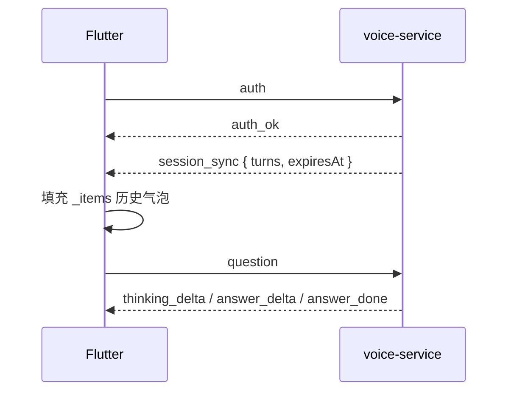

## Context

- **现状**：`voice:clinic:session:{wxId}` 已在首条 `question` 后写入 Redis，结构含 `turns[]`（`question`+`answer`，无 thinking）、`firstQuestionAt`、12h 固定 TTL。`voice_clinic_ws.go` 在 `auth_ok` 后即进入读循环，**不下发**历史轮次。Flutter `pangbao_ai_screen.dart` 的 `_ThinkingBlock` 折叠态使用 `NeverScrollableScrollPhysics`，长 thinking 流只显示顶部旧行。用户向文案混用「胖宝」「胖宝 AI」「AI 诊室」。
- **约束**：不新增 Redis 键、不 sliding 续期 session TTL、不持久化 thinking；voice 禁止跨库；Flutter 跨仓；禁止新增测试与 background ticker。
- **参考实现**：首页 `home_voice_message_strip.dart` 在文本更新时对内层 `ScrollController.jumpTo(maxScrollExtent)`，折叠视口始终展示最新内容。

## Goals / Non-Goals

**Goals:**

- 用户可见功能名统一为 **「胖宝诊疗」**（诊疗页 AppBar、consent、额度 hint；首页入口 tooltip 仍为「胖宝」）。
- `auth_ok` 后（含重连）下发 **`session_sync`**，Flutter 恢复 12h 内已完成 Q&A 列表。
- thinking 折叠视口在流式过程中 **底对齐最新行**，用户 pin 后可「跟随最新」恢复。

**Non-Goals:**

- 修改 `/voice/clinic/ws` 路径、`clinic_ai` 额度语义、session TTL 策略或 Redis schema。
- 恢复 thinking 历史（Redis 未存，spec 明确不恢复）。
- 恢复进行中的半条流式回答（仅 `answer_done` 后写入 session 的轮次）。
- 修改首页 `app.dart` title「胖宝」或趋势/胖宝入口布局。

## Decisions

### 1. 用户可见命名矩阵

| 位置 | 文案 |
|------|------|
| 首页沉浸式 header tooltip | **胖宝**（不变） |
| 首页品牌 / `app.dart` title | **胖宝**（不变） |
| 诊疗页 AppBar | **胖宝诊疗** |
| consent 对话框标题 | **使用胖宝诊疗前请知悉**（或等价） |
| 额度 hint | **本月胖宝诊疗剩余 N 次** |
| 输入 hint（可选） | **问问胖宝诊疗…** |
| 代码/配置/Redis/API | `clinic` / `clinic_ai` / `voice:clinic:*` **不变** |

### 2. session_sync 协议

**时序**：`auth` 校验成功 → `auth_ok` → **立即** `session_sync`（同一连接，每次重连重复）。

**下行帧**：

```json
{
  "type": "session_sync",
  "turns": [
    { "question": "…", "answer": "…" }
  ],
  "expiresAt": 1718539200
}
```

- `turns`：来自 Redis `clinicSession.Turns`；仅含 question 与 answer 均非空的已完成轮次（与 LLM 上下文一致）。
- `expiresAt`：Unix 秒，= `firstQuestionAt + sessionTTL`（或 Redis `TTL` 反推的绝对过期时刻）；无 session 时 `turns: []`，`expiresAt: 0`（或省略，Flutter 按空会话处理）。
- **MUST NOT** 含 `thinking` 字段。

**实现落点**：

- `voice_clinic_ws.go`：`auth_ok` 后调用 `voice.Clinic().BuildSessionSync(ctx, wxID)`（或等价），`writeJSON` 下发。
- `clinic_session.go`：新增 `sessionSyncPayload(wxID)`，读 Redis + 计算 `expiresAt`；读失败 **MAY** 下发空 turns 并打 warning 日志（不阻断 `auth_ok` 后提问）。



### 3. Flutter session 恢复

- `ClinicWsClient` 解析 `session_sync`，通过 callback/stream 交给 `PangbaoAiScreen`。
- 收到 `session_sync` 时：**替换**或**合并**本地 `_items`——MVP 采用 **以服务端为准全量替换**已完成轮次（避免重连 duplicate）；若当前有 `_activeAssistant` 流式中，**MUST NOT** 覆盖进行中的 assistant 项（重连场景通常已 disconnect，流已中断）。
- 每条 turn 渲染为：user 气泡 + assistant（answer + 免责声明）；**不**渲染 thinking（历史无数据）。
- 可选：展示 `expiresAt` 临近提示（本变更 **Non-Goal**，不在 MVP 任务内）。

### 4. Thinking 内层滚动（对齐 home_voice_message_strip）

**问题根因**：折叠态 `ConstrainedBox(maxHeight: 5行)` + `NeverScrollableScrollPhysics` 固定 scroll offset=0，新 delta 追加在底部但视口仍显示顶部。

**方案**：

- `_ThinkingBlock` 改为 `StatefulWidget`，持有 `_innerScroll = ScrollController()`。
- 折叠态：`SingleChildScrollView(controller: _innerScroll, physics: ClampingScrollPhysics())`（**移除** `NeverScrollableScrollPhysics`）。
- `didUpdateWidget` / 收到 delta 后 post-frame：`jumpTo(_innerScroll.position.maxScrollExtent)`（与 `HomeVoiceMessageStrip._scrollToEnd` 一致）。
- **userPinnedScroll**（外层 ListView pin）：当用户手动上滑内层 scroll 且未在底部时，停止 auto jump；展示 **「跟随最新」** chip/button，点击后 `jumpTo(max)` 并清除 pin（对齐原 spec「用户 pin 后停止跟随直至明确恢复」）。
- **可选增强**（tasks 标 optional）：折叠区顶部 `LinearGradient` fade；流式时末尾 `▍` pulse 光标。

**展开态**：保留 tap 切换 `thinkingExpanded`，展开后内层可自由滚动，auto-scroll 仍跟随最新 unless pinned。

### 5. 隐私政策

- `privacy-policy.html` 用户向「胖宝 AI 诊室」改为「**胖宝诊疗**」；技术描述（7 天摘要、thinking）不变；更新生效日期。

## Risks / Trade-offs

- **[Risk] session_sync 与本地未同步的进行中问答冲突** → 仅服务端 completed turns 覆盖；流式中断后用户可能丢失半条回答（与现网一致，不扩大 scope）。
- **[Risk] 重连瞬间 duplicate 气泡** → Flutter 以 `session_sync` 全量替换策略去重。
- **[Risk] expiresAt 与 Redis TTL 微差** → 以 `firstQuestionAt + configured TTL` 为主，Redis TTL 只作校验日志。

## Migration Plan

1. 部署 voice-service（`session_sync` 帧，向后兼容：旧 App 忽略未知帧）。
2. 部署 Flutter（命名 + session 恢复 + thinking scroll）。
3. 随 gateway 静态资源发布 privacy-policy 文案修订。
4. **Rollback**：voice 停止发送 `session_sync` 不影响旧 App；Flutter 可独立回滚 UI。

## Open Questions

（无——产品命名与 session 恢复范围已在 exploration 确认。）
